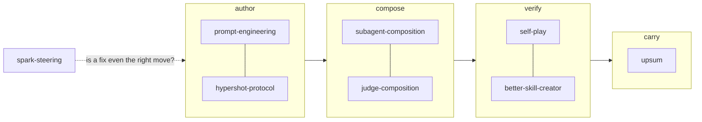

# dovetail

*Eight Claude Code skills that hold together by shape, not by glue.*

[](LICENSE.md)


A dovetail joint holds because of how the pieces are cut. No fasteners, no
adhesive — the strength *is* the fit. That is the claim this pack makes about
these eight skills, and it is meant literally: each is independently useful, and
each one's weak point is another one's subject.

## The joint



You write instructions for a model, you compose agents to carry them, you check
what comes back without deceiving yourself, and you close the session so the
next one starts from what happened rather than from what you remember. Every
skill here is a countermeasure against fluent output that feels like rigor.

| skill | what it is for |
|---|---|
| [prompt-engineering](https://github.com/OpenCnid/prompt-engineering) | structural clarity over magic words — tagging, markers, placeholders, attention |
| [hypershot-protocol](https://github.com/OpenCnid/hypershot-protocol) | priming structure without priming content; frames with free variables |
| [subagent-composition](https://github.com/OpenCnid/subagent-composition) | what crosses the sub-agent boundary, and the return contract that survives it |
| [judge-composition](https://github.com/OpenCnid/judge-composition) | four invariant roles, composed fresh per question. No default cast |
| [self-play](https://github.com/OpenCnid/self-play) | a clean-room search over a space you have not solved |
| [better-skill-creator](https://github.com/OpenCnid/better-skill-creator) | author a skill, then find out whether it actually helps |
| [upsum](https://github.com/OpenCnid/upsum) | what survives a session, decided on purpose rather than by what you happen to remember — **invoke it yourself; it does not auto-fire** |
| [spark-steering](https://github.com/OpenCnid/spark-steering) | which capability axis is short, before you install a fix that charges rent — **invoke it yourself; it does not auto-fire** |

**Six of the eight trigger on their own. `spark-steering` and `upsum` do not**,
by design: both carry `disable-model-invocation: true`, and both make that trade
for the same reason. A diagnostic that volunteers itself becomes a tax on every
turn; a close ceremony that volunteers itself runs on every throwaway session.
In each case that is the failure mode the skill exists to prevent.

Verified on CLI 2.1.214 by asking a headless session to enumerate its skills:
**`spark-steering` does not appear in that list at all.** The model cannot see it,
so asking Claude to use it does not work either — it does not know the skill
exists. **You invoke it yourself, by typing `/spark-steering`**, which loads it
normally. `upsum` carries the same flag and `/upsum` loads it the same way; that
one has not been put through the headless check, so treat its absence from the
list as expected rather than as observed.

A correctly installed pack therefore looks like six skills Claude can reach and
two it will deny having. That is the intended state, not a broken install.

## Install

### As a plugin

```bash
/plugin marketplace add OpenCnid/dovetail
/plugin install dovetail@opencnid
/reload-plugins
```

Plugin skills are namespaced, so they cannot collide with skills you already
have — you'll reach them as `dovetail:self-play` and so on.

Installing the pack loads all nine skills at once, and a `SessionStart` hook
injects `dovetail:using-dovetail` — the companion rule, and the notice that two
of the skills are invisible to the model — into every session.

> [!IMPORTANT]
> **Partly verified.** On CLI 2.1.214 (Windows 10), `marketplace add` +
> `install` against a **local checkout** registers all nine skills and the
> `SessionStart` hook, and the hook fires. What that run does *not* test is the
> thing this note was originally about: the pack holds its skills as **git
> submodules**, and whether a fetch **from GitHub** recurses into them is still
> unconfirmed — the local source already had them checked out. If the skills come
> back empty, that is why; use the direct install below, which has no such
> dependency, and please open an issue so this half can be replaced with a fact
> too.

### Directly

```bash
git clone --recurse-submodules https://github.com/OpenCnid/dovetail.git
cd dovetail
bash scripts/install.sh
```

`--dry-run` to see what it would do, `--force` to replace skills you already
have, `--project` to install into `./.claude/skills` and commit them with a
repo. It refuses to overwrite anything without `--force`, and if you forget
`--recurse-submodules` it fetches them for you rather than installing a hollow
pack.

## No copies

**This repository contains zero copies of any vendored skill.** Every one is a
submodule pinned to a commit, so a drifted pin is a diff rather than a
discovery. That is a deliberate correction: an earlier arrangement kept vendored
copies, and one of them silently fell four thousand characters behind its
source.

The one file of skill text written here is `skills/using-dovetail/SKILL.md`,
which describes how the eight compose. It copies nothing: no source repository
can write it, because none of them knows it will be packaged as `dovetail`.

```bash
bash scripts/sync.sh --check   # report which pins are behind
bash scripts/sync.sh           # advance them; commit the bumps yourself
```

Each source repository stays canonical for its own development. This pack is the
**install path**, not the authority — where a pin and its source disagree, the
source wins and the pin gets moved.

## What is honestly weak here

- **The plugin install route is unverified.** See the note above. The direct
  route is the one we have actually run.
- **`prompt-engineering` and `hypershot-protocol` are not our method.** They are
  the Lexideck curriculum compressed into deployable form. The work is
  [Matthew Murphy's](https://github.com/gusthemole); credit the source, not the
  application.
- **`spark-steering` cites a 373-primitive corpus kept elsewhere**, so its
  `references/` point at material a reader here cannot open.
- **`upsum`'s summary gradient is a design, not a measured result.** Its own
  README says so: nobody has run it long enough to know whether spending the
  words on the newest entries keeps a growing record honest.
- **Nobody has measured that these eight work better together than apart.** The
  composition is argued from how they cite each other, not demonstrated. Given
  what `self-play` says about entailed outcomes, that comparison would need
  designing carefully rather than running casually.

## Standing on the shoulders of giants

The prompt-engineering toolkit and the hypershot technique are
**[Matthew Murphy's](https://github.com/gusthemole)** Lexideck curriculum. Every
frame in every skill here is a hypershot, and the idea that a variable's name can
carry its own generation rule is his. The SPARK axes come from
[arXiv:2508.01581](https://arxiv.org/abs/2508.01581). The Claude Code mechanics
these skills describe are Anthropic's product behaviour, documented at
[code.claude.com/docs](https://code.claude.com/docs).

## License

Prose and pack: [CC BY 4.0](LICENSE.md) © OpenCnid Labs. Each vendored skill
carries its own license in its own repository.

---

<div align="center">
<sub>Cut to fit. No glue.</sub>
</div>
