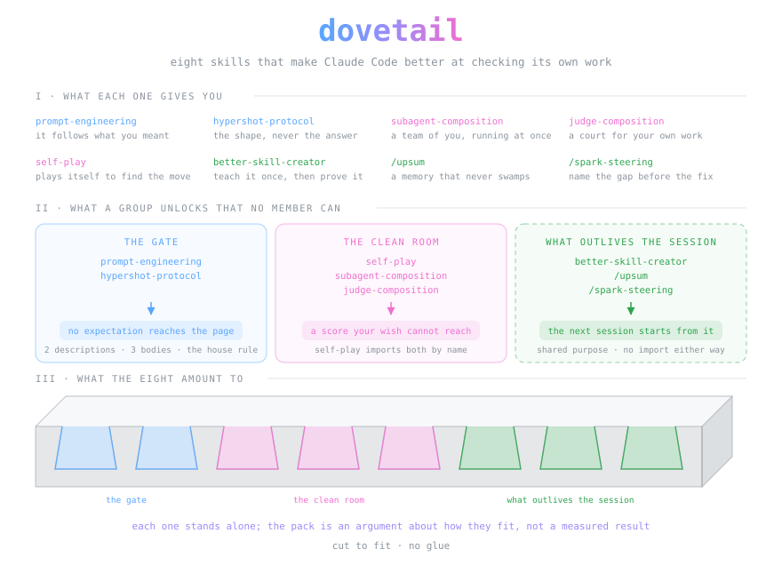

# dovetail

<p align="center">
  
</p>

**Eight skills that make Claude Code better at checking its own work.**

[](LICENSE.md)


A skill is just a page of instructions that Claude reads when it's relevant. You
don't have to call them or configure them. You describe what you want in normal
words, and the right one shows up.

These eight cover the parts of AI work that tend to go wrong quietly: writing
clear instructions, handing a job to a helper agent, checking whether an answer
actually holds up, and ending a session without losing what you learned.

## Install

One way, about a minute. You get all eight skills in every project on your
computer.

### Ask your agent to do it

Paste this into Claude Code:

> Install the dovetail plugin for me. Run these two commands:
>
> `claude plugin marketplace add https://github.com/OpenCnid/dovetail.git`
>
> `claude plugin install dovetail@opencnid`
>
> Use the full `https://` address exactly as written. When it's done, tell me
> which `dovetail:` skills you can see.

### Or type it yourself

In Claude Code:

```
/plugin marketplace add https://github.com/OpenCnid/dovetail.git
/plugin install dovetail@opencnid
/reload-plugins
```

Either way, **use the full `https://` address**. The short `OpenCnid/dovetail`
form connects over SSH and fails with *Permission denied (publickey)* if you
don't have SSH keys set up, even though this repo is public.

If your agent did the install for you partway through a session, run
`/reload-plugins` (or just restart Claude Code) so the new skills show up.

Skills from a plugin get a name prefix, so they can't clash with anything you
already have. You'll see them as `dovetail:self-play` and so on.

## Did it work?

Ask Claude: **"what skills do you have?"**

Six of these should be in the list, each with a `dovetail:` in front of it:

`prompt-engineering` · `hypershot-protocol` · `subagent-composition` ·
`judge-composition` · `self-play` · `better-skill-creator`

`spark-steering` and `upsum` will be missing. That's correct, and the next
section explains why.

Carrying the pack costs about 1,400 tokens a session — that's the eight
one-line descriptions, which is all Claude holds until a skill actually fires.
The full instructions load only when one is needed. (Measured 2026-08-05 with
`claude plugin details dovetail`, which will tell you the current number.)

## Using them

**Six of them run on their own.** You don't need to remember any names. Say what
you're doing and the matching skill loads itself.

| Say something like | What kicks in |
|---|---|
| "write me a prompt for a summarizer" | `prompt-engineering` + `hypershot-protocol` |
| "send a few agents to look into this" | `subagent-composition` |
| "is this claim actually true?" | `judge-composition` |
| "does this design hold up, really?" | `self-play` |
| "turn this into a skill I can reuse" | `better-skill-creator` |

**Two of them you type yourself**, as slash commands:

- `/upsum` — at the end of a session. Writes down what happened and what's still
  open, so your next session doesn't start from scratch.
- `/spark-steering` — before you add another plugin, rule, or MCP server. Works
  out what's actually missing first, so you don't install something permanent to
  fix something temporary.

Start typing `/ups` or `/spark` and pick from the menu that appears. Installed
as a plugin they may be listed as `/dovetail:upsum` and `/dovetail:spark-steering`,
so let the autocomplete fill in the exact name.

These two are hidden from Claude on purpose. It genuinely cannot see them: ask
"do you have spark-steering?" and it will say no. It isn't being difficult, the
skill is kept out of its list. Typing it yourself loads it normally.

The reason is that both would be annoying if they volunteered. A "what's
actually missing here?" check that pipes up every turn is a tax on every turn.
A session-closing ceremony that fires by itself runs on every throwaway chat.
So you decide when. (Confirmed on Claude Code CLI 2.1.214.)

## The eight skills

| Skill | What it's for |
|---|---|
| [prompt-engineering](skills/prompt-engineering/SKILL.md) | Writing instructions that are clear enough to follow. Structure over magic words. |
| [hypershot-protocol](skills/hypershot-protocol/SKILL.md) | Showing the *shape* of a good answer without accidentally giving away the content. |
| [subagent-composition](skills/subagent-composition/SKILL.md) | Handing a job to a helper agent so what comes back is actually useful. |
| [judge-composition](skills/judge-composition/SKILL.md) | Setting up impartial judges to check a claim, including your own. |
| [self-play](skills/self-play/SKILL.md) | Testing an idea fairly when your own opinion of it can't be trusted. |
| [better-skill-creator](skills/better-skill-creator/SKILL.md) | Building a skill, then finding out whether it actually helped. |
| [upsum](skills/upsum/SKILL.md) | Closing a session on purpose. **Type `/upsum`** — it won't fire by itself. |
| [spark-steering](skills/spark-steering/SKILL.md) | Finding what's really missing before you install a fix. **Type `/spark-steering`.** |

Roughly in order of use: write the instructions, hand the work off, check what
comes back, close out the session.

They're meant to hold together. Each one is useful alone, and each one's weak
spot is another one's job.

## What's in here

You don't need this repo to use the skills — the plugin install handles that.
It's here if you want to read them or change them.

Every skill lives in `skills/<name>/`. That's it: no submodules, no pins, no
sync step. A plain `git clone` gives you the whole thing.

[`docs/provenance.md`](docs/provenance.md) records where each skill came from.
[`RELEASE-NOTES.md`](RELEASE-NOTES.md) has the history, including why the pack
used to be built out of eight separate repos and why it isn't any more.

To check nothing is broken after an edit:

```bash
bash scripts/test-skills.sh
```

The live half installs the pack into a scratch `CLAUDE_CONFIG_DIR` rather than
your own. It proves that redirect took effect before it writes anything, and
exits 2 without running rather than touching your real `~/.claude` when it
cannot.

## Honest bits

Things worth knowing before you rely on this:

- **Only tested on Windows.** The plugin install was run for real on Claude Code
  CLI 2.1.214, Windows 10, and every skill loaded. Nobody has tried macOS or
  Linux yet, so there may be traps this machine can't see.
- **A skill that loads isn't proof of a skill that works.**
  `scripts/test-skills.sh` checks that each skill reaches the session. It can't
  check whether Claude then does anything differently.
- **Nobody has measured that these eight work better together than apart.** The
  case for that is an argument about how they fit, not a result.
- **`prompt-engineering` and `hypershot-protocol` aren't ours.** They're
  [Matthew Murphy's](https://github.com/gusthemole) Lexideck curriculum, boiled
  down into something you can install.
- **`spark-steering` points at material kept elsewhere.** Its `references/`
  cite a 373-item corpus that isn't in this repo, so those links won't open.
- **`upsum`'s design hasn't been measured either.** Its own notes say so. Nobody
  has run it long enough to know whether it keeps a growing record honest.

**If the install fails on Windows** with `fetch-pack: invalid index-pack
output`, that's a path length limit, not a network problem. Run this once and
try again:

```bash
git config --global core.longpaths true
```

(One skill carries deep test files. Its longest path is 136 characters, leaving
62 to spare under a default `~/.claude` — a long username or a deep
`CLAUDE_CONFIG_DIR` uses that up. Measured 2026-08-05; re-measure rather than
trusting the number.)

## Credits

The prompt-engineering toolkit and the hypershot technique are
**[Matthew Murphy's](https://github.com/gusthemole)** Lexideck curriculum. The
idea that a variable's name can carry its own instructions is his.

The SPARK axes come from [arXiv:2508.01581](https://arxiv.org/abs/2508.01581).
The Claude Code behaviour these skills describe is Anthropic's, documented at
[code.claude.com/docs](https://code.claude.com/docs).

## License

[CC BY 4.0](LICENSE.md) © OpenCnid Labs. Each skill also carries its own
license in its own folder.

---

<div align="center">
<sub>Cut to fit. No glue.</sub>
</div>
