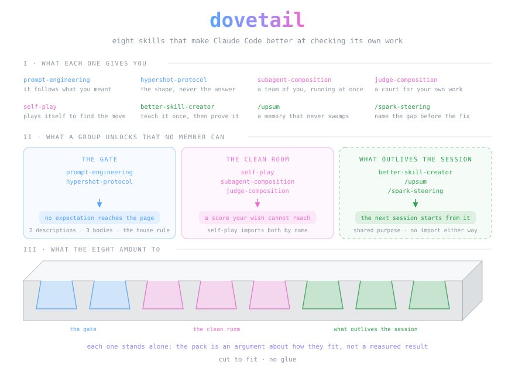

# dovetail

<p align="center">
  
</p>

**Eight skills that make Claude Code and Codex better at checking their own work.**

[](LICENSE.md)


A skill is a page of instructions an agent reads when it's relevant. You don't
have to configure the six automatic skills: describe what you want in normal
words, and the matching one shows up.

These eight cover the parts of AI work that tend to go wrong quietly: writing
clear instructions, handing a job to a helper agent, checking whether an answer
actually holds up, and ending a session without losing what you learned.

## Install

Dovetail has additive paths for **Claude Code** and **Codex**. Both use the
same `skills/` source tree; the existing Claude plugin folders and workflows
stay in place.

### Claude Code

One way, about a minute. You get all eight skills in every project on your
computer.

#### Ask your agent to do it

Paste this into Claude Code:

> Install the dovetail plugin for me. Run these two commands:
>
> `claude plugin marketplace add https://github.com/OpenCnid/dovetail.git`
>
> `claude plugin install dovetail@opencnid`
>
> Use the full `https://` address exactly as written. When it's done, tell me
> which `dovetail:` skills you can see.

#### Or type it yourself

In Claude Code:

```
/plugin marketplace add https://github.com/OpenCnid/dovetail.git
/plugin install dovetail@opencnid
/reload-plugins
```

Either way, **use the full `https://` address**. The short `OpenCnid/dovetail`
form connects over SSH and fails with *Permission denied (publickey)* if you
don't have SSH keys set up, even though this repo is public.

If your agent did the install for you partway through a session, run
`/reload-plugins` (or just restart Claude Code) so the new skills show up.

Skills from a plugin get a name prefix, so they can't clash with anything you
already have. You'll see them as `dovetail:self-play` and so on.

### Codex

From a Dovetail checkout, start Codex in the repository root. Codex discovers
all eight skills through the checked-in `.agents/skills/` links, which point back
to the shared `skills/` folders. If a Windows Git checkout cannot materialize
those links as folders, use the installer below instead; it copies the full
skill directories and does not depend on symlink support:

```bash
git clone https://github.com/OpenCnid/dovetail.git
cd dovetail
codex
```

To install independent user copies for any Codex workspace, run this from the
Dovetail checkout:

```bash
bash scripts/install-codex.sh
```

That copies the eight skills to `~/.agents/skills`. To copy them into another
project instead, run `/path/to/dovetail/scripts/install-codex.sh --project` from
that target project. The script refuses `--project` in this checkout, because
Codex already sees the source links here and replacing them with copies would
create two editable trees.

## Did it work?

### Claude Code

Ask Claude: **"what skills do you have?"**

Six of these should be in the list, each with a `dovetail:` in front of it:

`prompt-engineering` · `hypershot-protocol` · `subagent-composition` ·
`judge-composition` · `self-play` · `better-skill-creator`

`spark-steering` and `upsum` will be missing. That's correct, and the next
section explains why.

Carrying the pack costs about 1,400 tokens a session — that's the eight
one-line descriptions, which is all Claude holds until a skill actually fires.
The full instructions load only when one is needed. (Measured 2026-08-05 with
`claude plugin details dovetail`, which will tell you the current number.)

### Codex

Run `/skills`, or type `$`, from the Dovetail checkout. You should see all eight
skills. Codex uses the source folders through `.agents/skills/`, so each skill's
name and instructions are the same files Claude Code receives.

`$spark-steering` and `$upsum` remain explicit-only. They are visible in Codex's
skill picker, but their Codex policies prevent automatic matching; type the
`$` name when you want either workflow.

## Using them

**Six of them run on their own.** You don't need to remember any names. In
Claude Code or Codex, say what you're doing and the matching skill loads itself.

| Say something like | What kicks in |
|---|---|
| "write me a prompt for a summarizer" | `prompt-engineering` + `hypershot-protocol` |
| "send a few agents to look into this" | `subagent-composition` |
| "is this claim actually true?" | `judge-composition` |
| "does this design hold up, really?" | `self-play` |
| "turn this into a skill I can reuse" | `better-skill-creator` |

**Two need explicit invocation** because they would be noisy if they ran on
every matching request:

| Workflow | Claude Code | Codex |
|---|---|---|
| Close a session with its durable state | `/upsum` (often `/dovetail:upsum`) | `$upsum` |
| Diagnose the missing SPARK axis before installing a fix | `/spark-steering` (often `/dovetail:spark-steering`) | `$spark-steering` |

Claude Code hides these two from its automatic skill list; typing the command
loads them normally. Codex keeps them visible in `/skills` but uses
`agents/openai.yaml` to reject implicit invocation, so typing the `$` name is
still required.

The reason is that both would be annoying if they volunteered. A "what's
actually missing here?" check that pipes up every turn is a tax on every turn.
A session-closing ceremony that fires by itself runs on every throwaway chat.
So you decide when. (Claude Code behavior confirmed on CLI 2.1.214.)

## The eight skills

| Skill | What it's for |
|---|---|
| [prompt-engineering](skills/prompt-engineering/SKILL.md) | Writing instructions that are clear enough to follow. Structure over magic words. |
| [hypershot-protocol](skills/hypershot-protocol/SKILL.md) | Showing the *shape* of a good answer without accidentally giving away the content. |
| [subagent-composition](skills/subagent-composition/SKILL.md) | Handing a job to a helper agent so what comes back is actually useful. |
| [judge-composition](skills/judge-composition/SKILL.md) | Setting up impartial judges to check a claim, including your own. |
| [self-play](skills/self-play/SKILL.md) | Testing an idea fairly when your own opinion of it can't be trusted. |
| [better-skill-creator](skills/better-skill-creator/SKILL.md) | Building a skill, then finding out whether it actually helped. |
| [upsum](skills/upsum/SKILL.md) | Closing a session on purpose. **Invoke explicitly:** `/upsum` in Claude Code or `$upsum` in Codex. |
| [spark-steering](skills/spark-steering/SKILL.md) | Finding what's really missing before you install a fix. **Invoke explicitly:** `/spark-steering` in Claude Code or `$spark-steering` in Codex. |

Roughly in order of use: write the instructions, hand the work off, check what
comes back, close out the session.

They're meant to hold together. Each one is useful alone, and each one's weak
spot is another one's job.

## What's in here

You don't need this repo to use the Claude Code plugin. For Codex, use the
checkout directly or run the Codex installer above. It's here if you want to
read or change the shared source skills.

Every skill lives in `skills/<name>/`. That's it: no submodules, no pins, no
sync step. A plain `git clone` gives you the whole thing.

[`docs/provenance.md`](docs/provenance.md) records where each skill came from.
[`RELEASE-NOTES.md`](RELEASE-NOTES.md) has the history, including why the pack
used to be built out of eight separate repos and why it isn't any more.
[`docs/release-integrity.md`](docs/release-integrity.md) is what you can check
about a release you received, and what it does not yet establish.

To check nothing is broken after an edit:

```bash
bash scripts/test-skills.sh
```

That's two different checks with one command. The *static* half reads the files
on disk — every skill has a `SKILL.md`, its name matches its directory, nothing
is missing from the install list, no body carries the one character sequence
that makes a skill load as nothing. It needs no Claude and touches nothing, so
you can run it on its own:

```bash
bash scripts/test-skills.sh --static
```

The *live* half actually installs the pack and opens a session per skill, which
is the only way to catch a skill that resolves but whose body never arrives.
Static passing tells you the pack is shaped right; only the live half tells you
a skill loads. CI runs the static half and never the live one.

The live half installs into a scratch `CLAUDE_CONFIG_DIR` rather than your own.
It proves that redirect took effect before it writes anything, and exits 2
without running rather than touching your real `~/.claude` when it cannot.

If you're on WSL with Claude installed on the Windows side, the paths have to be
converted before that CLI can read them, and which conversion depends on what
your `claude` actually is rather than on your OS. That conversion is done for
you; whether a full live run then completes on WSL is not something anyone has
checked yet. To see what it would use, without running anything:

```bash
bash scripts/test-skills.sh --plan
```

It prints the plan and stops. It needs `claude` on your `PATH` to have something
to plan for, and it doesn't install, launch or write anything.

The Codex bridge has its own local check:

```bash
bash scripts/test-codex-skills.sh
```

It verifies that all eight `.agents/skills` entries resolve to the shared source
folders, that `$spark-steering` and `$upsum` stay explicit-only, and that the
Codex installer makes a disposable copy. It does not invoke a Codex model, so a
passing result establishes discovery and installation shape—not model behavior.

## Honest bits

Things worth knowing before you rely on this:

- **Only tested on Windows.** The plugin install was run for real on Claude Code
  CLI 2.1.214, Windows 10, and every skill loaded. Nobody has tried macOS or
  Linux yet, so there may be traps this machine can't see. One narrow exception,
  so it isn't mistaken for more than it is: `scripts/test-skills-paths.sh` and
  `test-skills.sh --plan` were run in a Linux userland (WSL 2.6.3.0,
  Ubuntu-24.04) on 2026-08-06 and pass there. That exercises the path decision
  and nothing else — no plugin was installed and no skill was loaded on Linux.
- **A skill that loads isn't proof of a skill that works.**
  `scripts/test-skills.sh` checks that each skill reaches the session. It can't
  check whether Claude then does anything differently.
- **Nobody has measured that these eight work better together than apart.** The
  case for that is an argument about how they fit, not a result.
- **`prompt-engineering` and `hypershot-protocol` aren't ours.** They're
  [Matthew Murphy's](https://github.com/gusthemole) Lexideck curriculum, boiled
  down into something you can install.
- **`spark-steering` points at material kept elsewhere.** Its `references/`
  cite a 373-item corpus that isn't in this repo, so those links won't open.
- **`upsum`'s design hasn't been measured either.** Its own notes say so. Nobody
  has run it long enough to know whether it keeps a growing record honest.

**If the install fails on Windows** with `fetch-pack: invalid index-pack
output`, that's a path length limit, not a network problem. Run this once and
try again:

```bash
git config --global core.longpaths true
```

(One skill carries deep test files. Its longest path is 136 characters, leaving
62 to spare under a default `~/.claude` — a long username or a deep
`CLAUDE_CONFIG_DIR` uses that up. Measured 2026-08-05; re-measure rather than
trusting the number.)

## Credits

The prompt-engineering toolkit and the hypershot technique are
**[Matthew Murphy's](https://github.com/gusthemole)** Lexideck curriculum. The
idea that a variable's name can carry its own instructions is his.

The SPARK axes come from [arXiv:2508.01581](https://arxiv.org/abs/2508.01581).
The Claude Code behaviour these skills describe is Anthropic's, documented at
[code.claude.com/docs](https://code.claude.com/docs).

## License

[CC BY 4.0](LICENSE.md) © OpenCnid Labs. Each skill also carries its own
license in its own folder.

---

<div align="center">
<sub>Cut to fit. No glue.</sub>
</div>
